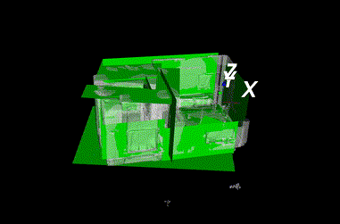

# CGAL plane detection

[](https://github.com/phygitalism/cgal-plane-detector/actions/workflows/build.yaml)

## Description

[CGAL](https://www.cgal.org/) region growing algorithm for plane detection.



## Requirements

1. CGAL 5.0 or higher.
2. Boost: math, filesystem, program options. Project was tested with Boost 1.71.
3. CMake 3.20 or higher.
4. Optional. [VTK](https://vtk.org/). It need only for visualization.
5. Compiler with support C++14.
6. Ninja (for Linux).
7. Visual Studio 16 (for Windows).

## How to run

### Linux

[See GitHub Action for compilation from source](/.github/workflows/build.yaml)

```bash
cmake --preset linux-ninja
cmake --build ./build --config Release
```

### Windows

[See GitHub Action for compilation from source](/.github/workflows/build.yaml)

[Download CGAL (CGAL-*-library.zip) and GMP (GMP and MPFR libraries, for Windows 64bits) from release page](https://github.com/CGAL/cgal/releases)

Unzip GMP and MPFR libraries. Set env variable `GMP_DIR`, `MPFR_DIR` to the `<a path to GMP from archive>/auxiliary`

Run CMake (PowerShell):

```powershell
$env:GMP_DIR = "<a path to GMP from archive>/auxiliary"
$env:MPFR_DIR = "<a path to GMP from archive>/auxiliary"
cmake --preset windows-vc16 -DCGAL_DIR:PATH="<a path to CGAL directory from archive/lib/cmake/CGAL"
cmake --build ./build --config Release
```

Find executable (for Windows):
```
.\cgal-plane-detection.exe -i input_mes.obj -o segmented.ply -c
```

Results are three files:

1. Segmented mesh `segmented.ply`.
2. Bounding planes in the `segmented-planes.ply` as mesh.
3. Coordinates of bounding planes in the `segmented-planes.txt`.

You can download example from [Sketchfab](https://skfb.ly/6tJLJ).

See `--help` for additional parameters

Some parameters [are described here](https://doc.cgal.org/latest/Shape_detection/classCGAL_1_1Shape__detection_1_1Point__set_1_1Least__squares__plane__fit__region.html#acae6e40ba29b98a433e125622ba5ec80) 

Argument `-d` allow to see results (if you compile with VTK).

## Remarks

For best result you need axis aligned model.
